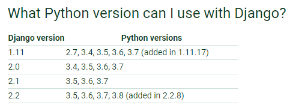

#python入门
###环境安装
- [官网地址](https://www.python.org/downloads/release/python-380/)

- 安装:记得勾选添加到系统path下(会自动加入环境变量)

- 验证:win+r -> cmd -> python -V (python版本) -> pip --version(pip版本)

### 命名规范
- 类名使用驼峰 如QuickStart

- 函数名一律小写多个单词间用下划线分开 如run_with_test

- 私有函数在前面加一个下划线 如_private_func

- 变量名尽量小写 如有多个单词 用下划线隔开 如var_name

- 常量使用大写 如有多个单词 用下划线隔开 如CONS_NAME

###基础语法
- python3.0及以上版本无需指定编码,默认为UTF-8

- 在python里单引号和双引号用法完全相同

- python里使用R和r对字符串进行转意

- 

### python流行框架Django
- [官网地址](https://docs.djangoproject.com/en/2.2/intro/install/)

- 安装 pip3 install django

- 验证 python -> import django -> print(django.get_version()) 

    

 